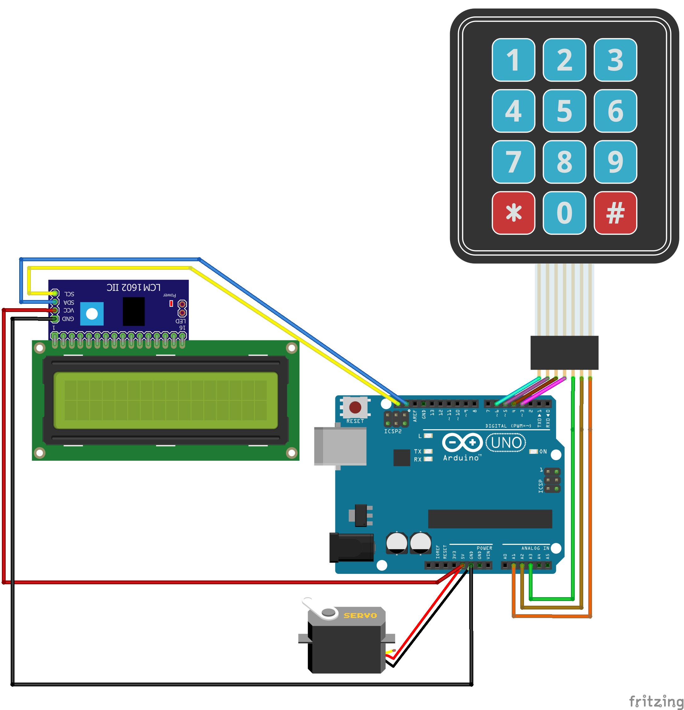

# arduino_safe_lock 🔐

### Note: heavily based on https://wokwi.com/arduino/libraries/demo/electronic-safe by Uri Shaked
The main changes from the original are: 

* LCD 16x2 wired using I²C
* smaller membrane keypad (3x4, the original featured a 4x4)
* messages in French

1. Requirements

    * arduino UNO
    * LCD 16*2 with I2C backplate
    * membrane keypad
    * servo motor
    * dupont female-female wires

2. Wiring
     (Made with Fritzing 0.9.9)

    [Download the Fritzing sketch](./wiring.fzz)